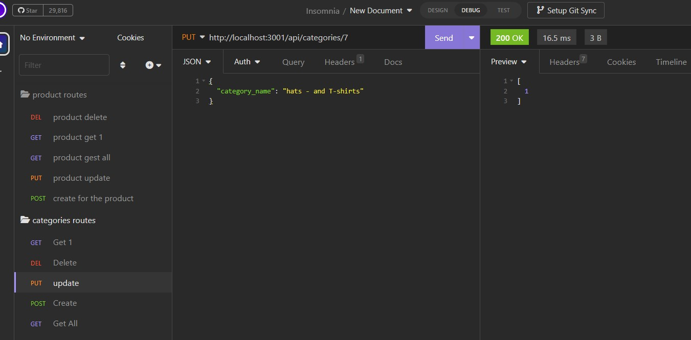

# E-commerce Back End Starter Code
## License

## Description
The e-coimerce industry is one of the largesst section in our economy. As a new develper is important to familiarize myslef with these concepts. 
By working on this project, I gain hands-on experience with Express.js, Sequelize, and MySQL, which are highly sought after in the industry. I am able
to create a framwork to add, update, delte items in the inverntory. 

## Table of Content
- [Description](#description)
- [Installation](#installation)
- [Usage](#usage)
- [License](#license)
- [References](#references)
- [Contact](#contact)

## Installation
1. Install all the project dependencies. (Express, mysql2, sequelize)
2. Clone this repository: github.com/DenCoding2023/E-C-Backend.git
3. Navigate to the directory containing serverr.js
4. Run the server using "npm start" in the terminal. 
5. Open your Insomnia and navigate to your localhost 3001.
6. Run the "Get, Post, Put and Delete request agaist the API.

## Usage

## References

1. https://stackoverflow.com/questions/50354817/sequelize-decimal-data-save-with-2-decimal-points
2. compare used as resource: https://github.com/mollysal/E-Commerce-Back-End/blob/main/models/ProductTag.js
3. Video Guide: https://youtu.be/b3jgsfbJijw

## Contact
1. Dennis Luciano
2. visiontopia@gmail.com